[](../../releases/latest)
[](../../releases/latest)
[](../../releases)
[](../../releases)
[](https://docs.flutter.dev/tools/sdk)
[](https://dart.dev/get-dart)
[](https://crowdin.com/project/refreezer)
[](./LICENSE)

[](https://dart.dev/)
[](https://flutter.dev/)
[](https://www.java.com/)

---

This repo is a MOD of the [ReFreezer](https://github.com/DJDoubleD/ReFreezer) app by @DJDoubleD.
My goal is to have a style closer to Deezer's original app.
To apply the Deezer theme, select it under Settings > Appearance > Theme.

## Screenshots

<p align="center">
    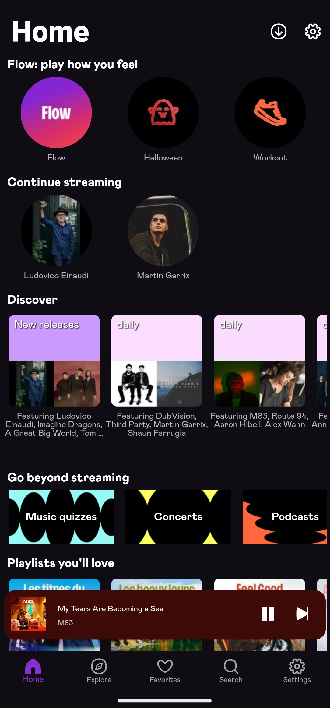
    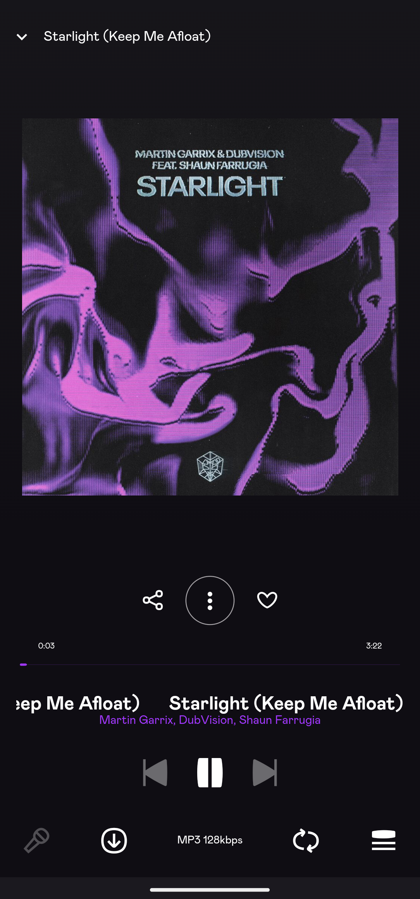
    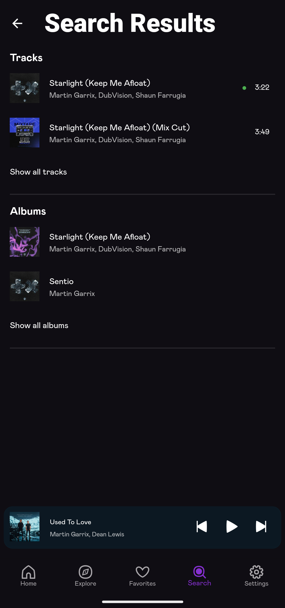
</p>

<details><summary><b>Original ReFreezer App</b></summary>
<p align="center">
    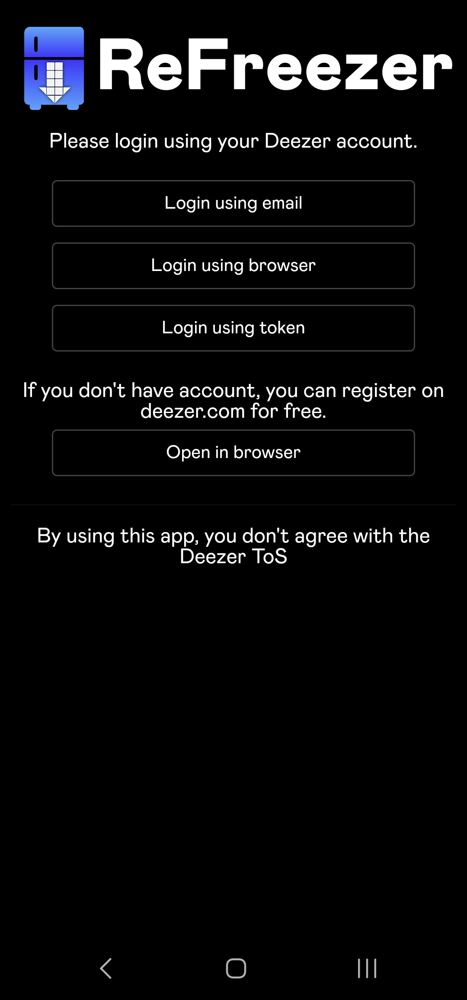
    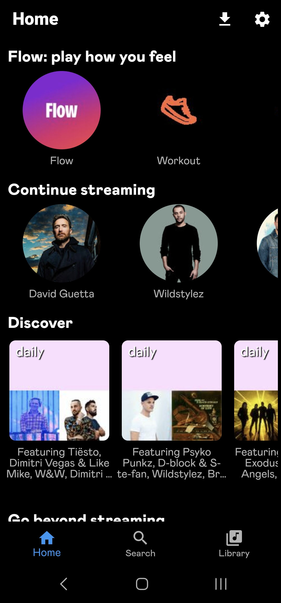
    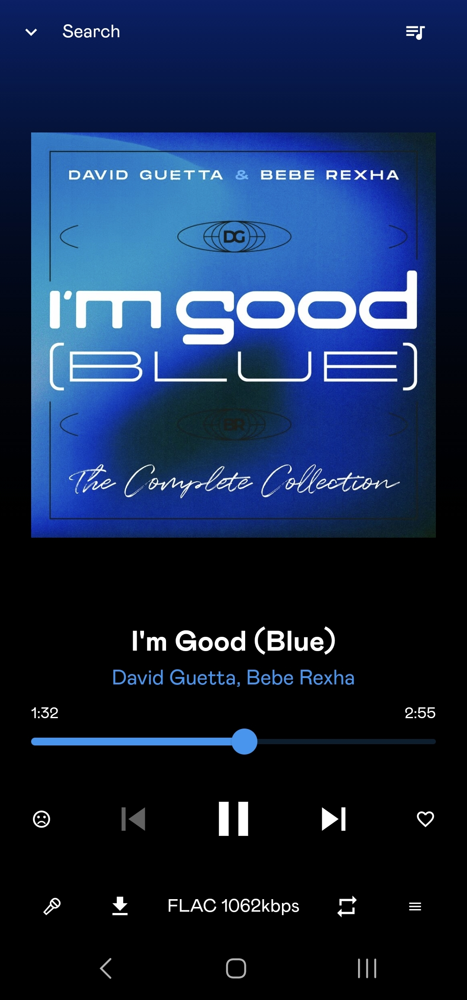
    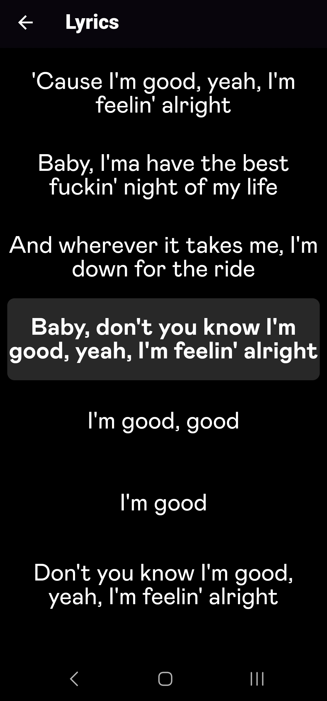
</p>
</details>

<details><summary><b>More Android Phone</b></summary>
<p align="center">
    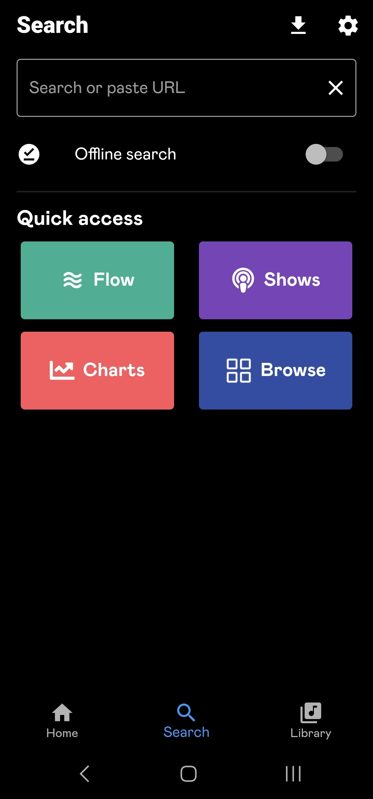
    
    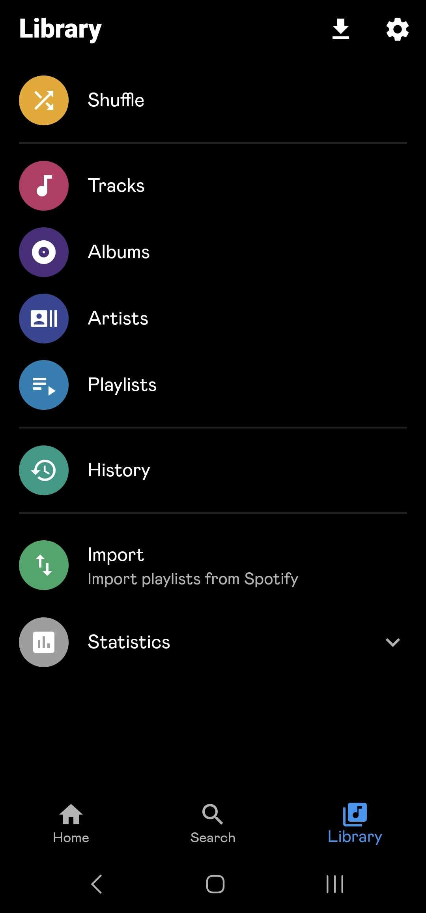
    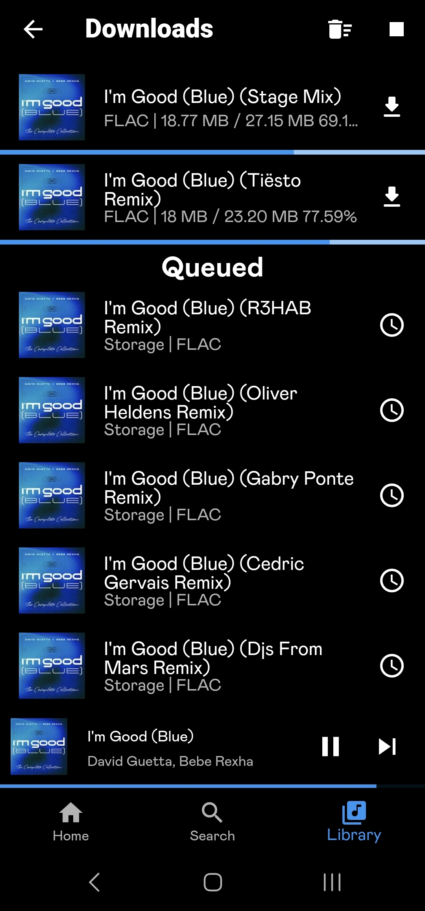
    <!------>
    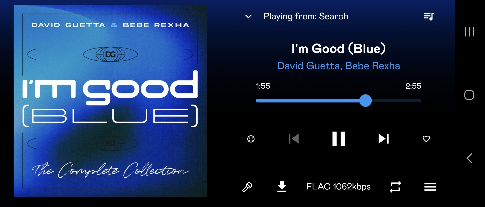
</p>
</details>
<details><summary><b>Android Auto</b></summary>
  <p align="center">
    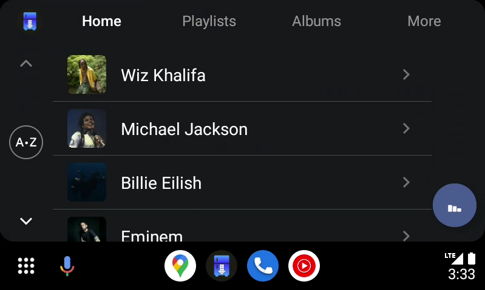
    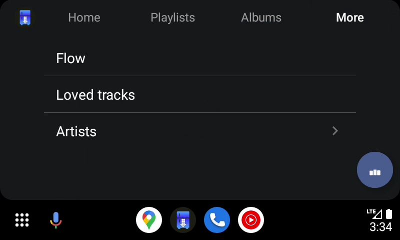
    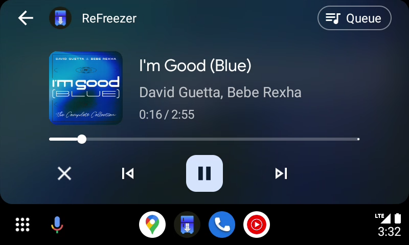
    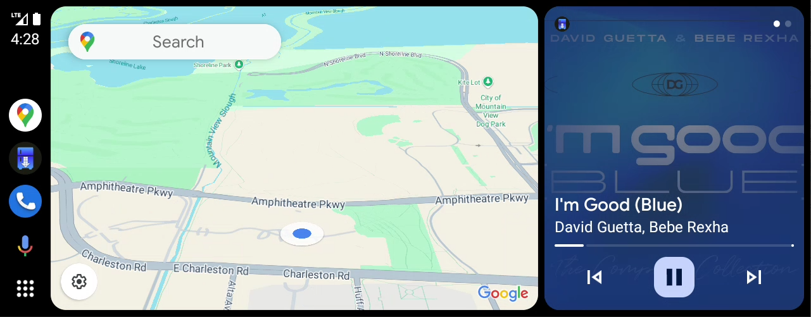
  </p>
</details>

## Features & changes

### Not working / On going
- Offline playlist / titles access
- Explore / Favorites page

### ReFreezer :
- Restored all features of the old Freezer app, most notably:
  - Restored all login options
  - Restored Highest quality streaming and download options (premium account required, free accounts limited to MP3 128kbps)
- Support downloading to external storage (sdcard) for android 11 and up
- Restored homescreen and added new Flow & Mood smart playlist options
- Fixed Log-out (no need for restart anymore)
- Improved/fixed queue screen and queue handling (shuffle & rearranging)
- Updated lyrics screen to also support unsynced lyrics
- Some minor UI changes to better accomadate horizontal/tablet view
- Updated entire codebase to fully support latest flutter & dart SDK versions
- Updated to gradle version 8.5.1
- Removed included c libraries (openssl & opencrypto) and replaced them with custom native java implementation
- Replaced the included decryptor-jni c library with a custom native java implementation
- Implemented null-safety
- Removed the need of custom just_audio & audio_service plugin versions & refactored source code to use the latest version of the official plugins
- Multiple other fixes

### MOD :
- Floating player bar with background color based on title artwork
- Deezer original icons
- Deezer original navigation menu (+ settings)
- Deezer clone player screen
- Deezer similar info menu

## Compile from source

Install the latest flutter SDK: <https://flutter.dev/docs/get-started/install>  
(Optional) Generate keys for release build: <https://flutter.dev/docs/deployment/android>

Download source:

```powershell
git clone https://github.com/DJDoubleD/ReFreezer
git submodule init
git submodule update
```

Create a `.env` file in the `lib` folder of the project and add the following content:

```text
# Deezer API credentials
deezerClientId = '<Your_Deezer_Client_Id>';
deezerClientSecret = '<Your_Deezer_Client_Secret>';

# LastFM API credentials
lastFmApiKey = '<Your_LastFM_API_Key>'
lastFmApiSecret = 'Your_LastFM_API_Secret'
```

Build generated files:

Use following script to (re)build generated classes in submodules and main project:

```powershell
.\run_build_runner.ps1
```

or run these commands manually in the relevant submodules to (re)build the generated files:

```powershell
flutter pub get
dart run build_runner clean
dart run build_runner build --delete-conflicting-outputs
```

Compile:

```powershell
 flutter build apk --split-per-abi --release
```

NOTE: You have to use own keys, or build debug using `flutter build apk --debug`

### Generate your own keys

#### Step 1: create a JKS file

Make sure your Java JDK folder is in your PATH variable and execute the following command in the ./android folder of the project:

```bash
keytool -genkey -v -keystore ./keys.jks -keyalg RSA -keysize 2048 -validity 10000 -alias <YourKeyAlias>
```

Follow the instructions show in the commandline to fill out the desired fields of your keystore.

#### Step 2: create a key.properties file

Inside the ./android (next to the keys.jks file from step 1), create a file `key.properties` with the following contents:

```text
storePassword=<storePassword>
keyPassword=<keyPassword>
keyAlias=<YourKeyAlias>
storeFile=../keys.jks
```

## Disclaimer & Legal

**ReFreezer** was not developed for piracy, but educational and private usage.
It may be illegal to use this in your country!
I will not be responsible for how you use **ReFreezer**.

**ReFreezer** uses both Deezer's public and internal API's, but is not endorsed, certified or otherwise approved in any way by Deezer.

The Deezer brand and name is the registered trademark of its respective owner.

**ReFreezer** has no partnership, sponsorship or endorsement with Deezer.

By using **ReFreezer** you agree to the following: <https://www.deezer.com/legal/cgu>
